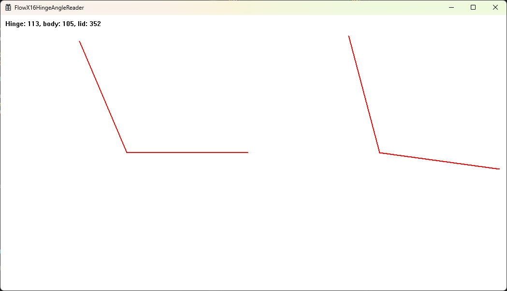

# FlowX16HingeAngleReader

Reads the raw data from the ASUS ROG Flow X16's Hinge Sensor.

The hinge sensor uses the accelerometers in the body and lid to calculate the angle of the hinge. The angle is then used to determine whether the device needs to be put in tablet mode or not.

I believe the sensor data is provided by an embedded controller, it's not done by the operating system.
The sensor stops reporting updates if the body of the laptop hasn't moved for 10 seconds, likely to save power.
This means that you can fold the laptop 360 degrees but keep the keyboard turned on, as long as the body doesn't rotate enough for the controller to determine it should start updating the sensor values. You can test this by placing the laptop down on a surface with the lid over the edge, then wait for a couple seconds and fold the lid all the way back, the keyboard stays on.

The sensor reports 3 values:

- The angle of the hinge in degrees.
- The angle of the lid in degrees.
- The angle of the body in degrees.

I was going to make something that does this myself with software using the accelerometers, but I found out that the ASUS ROG Flow X16 already has a controller that does these calculations, though the values are in degrees and they are integer values so it's not the most precise.

The Flow also has two motion detectors, one for the display and one for the body, not sure what their purpose is, perhaps the body motion sensor is what the controller watches to determine if the hinge angle should be updated.

